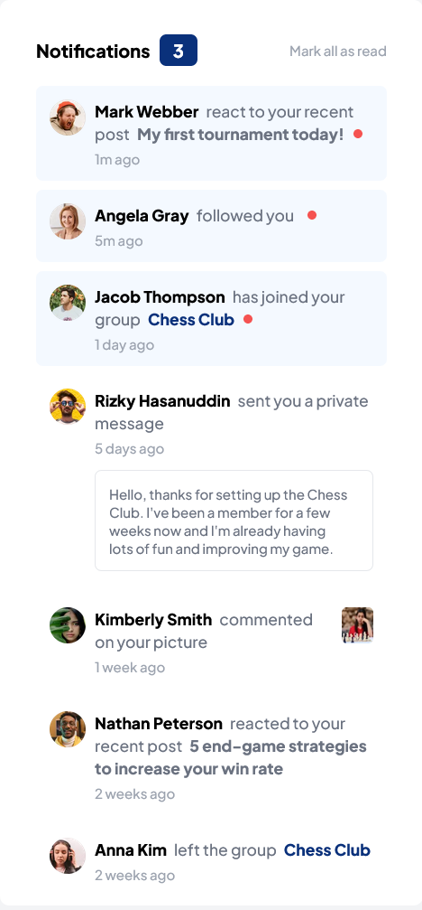
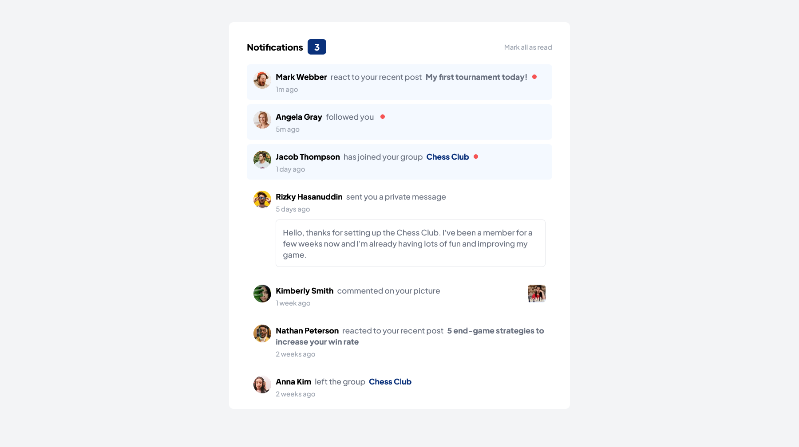

# Notifications page solution

This is a solution to the [Notifications page](https://www.frontendmentor.io/challenges/notifications-page-DqK5QAmKbC).

## Table of contents

- [Overview](#overview)
  - [The challenge](#the-challenge)
  - [Screenshot](#screenshot)
  - [Built with](#built-with)
- [Author](#author)

## Overview

### The challenge

Users should be able to:

- Distinguish between "unread" and "read" notifications
- Select "Mark all as read" to toggle the visual state of the unread notifications and set the number of unread messages to zero
- View the optimal layout for the interface depending on their device's screen size
- See hover and focus states for all interactive elements on the page

### Screenshot

- Mobile  
 

- Desktop 

### Built with

- Semantic HTML5 markup
- CSS custom properties
- Flexbox
- CSS Grid
- Mobile-first workflow
- [React](https://reactjs.org/) - JS library
- TailwindCSS

## Author

- Website - [Github](https://github.com/amrmabdelazeem)
- Frontend Mentor - [@amrmabdelazeem](https://www.frontendmentor.io/profile/amrmabdelazeem)
